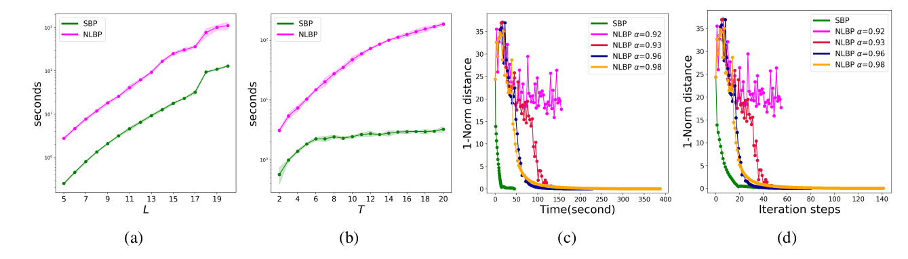

# Aggregate-Inference-MOT
Inference with Aggregate Data: An Optimal Transport Approach

# How to reproduce experiments
This repo contains two branches, which implements the `SBP`(Iterative Scaling with Belief Propagation or Sinkhorn Belief Propagation, [This Branch](https://github.com/zqsh/Aggregate-Inference-MOT/tree/itsbp)) and `NLBP`([This Branch](https://github.com/zqsh/Aggregate-Inference-MOT/tree/nlbp)) respectively. 

*Speed and convergence comparision between SBP and NLBP*  

*Population movement Estimation through Sparse Sensor*